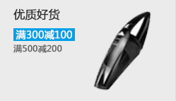
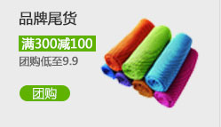
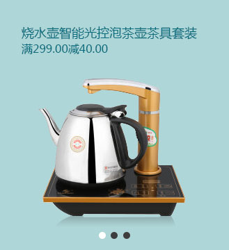
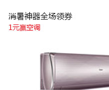

# 品优购网站制作

[TOC]

# 一、favicon图标制作

favicon.ico 一般用于缩略的网站标志，显示在浏览器的地址栏或者标签上


## 1.1 制作favicon图标

步骤：

1. 把图标切成png图片，借助第三方网站（eg：比特虫 http://www.bitbug.net/）把 png 格式转换为 ico 图标

2. 根据要求生成 ico 文件

3. 将 ico 图标放在根目录下

   

4. 将图标引入HTML文件

   ```html
   <link rel="shortcut icon" href=" /favicon.ico" />
   ```

   

# 二、网站TDK三大标签SEO优化

SEO 搜索引擎优化，利用搜索引擎的规则提高网站在有关搜索引擎内的自然排名方式。目的是对网站的深度优化，提高网站的知名度

页面必须有三个标签用来符合SEO优化


## 2.1 title 网站标签

建议：网站名（产品名）-网站的介绍


```html
<title>品优购商城—综合网购首选-正品低价、品质保障、配送及时、轻松购物！</title>
```


## 2.2 description网站说明

简要说明网站主要做什么

多采用**：“我们是.....”，“我们提供....”，“×××网作为...”, “电话：...”** 等


```html
<!-- 网站说明 -->
<meta name="description" content="品优购JD.COM-专业的综合网上购物商城,销售家电、数码通讯、电脑、家居百货、服装服饰、母婴、图书、食品等数万个品牌优质商品.便捷、诚信的服务，为您提供愉悦的网上购物体验!">
```


## 2.3 keywords 关键字

页面关键词 ，限制在6~8 个关键词，之间用英文的逗号隔开


```html
<!-- 关键词 -->
<meta name="Keywords" content="网上购物,网上商城,手机,笔记本,电脑,MP3,CD,VCD,DV,相机,数码,配件,手表,存储卡,品优购">
```


# 三、快捷导航 shortcut 制作


```html
<!-- 快捷导航模块 start -->
   <section class="shortcut">
       <div class="w">
           <div class="fl">
               <ul>
                   <li>品优购欢迎您！&nbsp;</li>
                   <li>
                       <a href="#">请登录 &nbsp;</a><a href="" class="style_red">免费注册</a>  <!-- 行内元素放在一行写 -->
                   </li>
               </ul>
           </div>
           <div class="fr">
               <ul>
                   <li>我的订单</li></li>
                   <li></li>
                   <li class="arrow-icon">我的品优购</li>
                   <li></li>
                   <li>品优购会员</li>
                   <li></li>
                   <li>企业采购</li>
                   <li></li>
                   <li class="arrow-icon">关注品优购</li>
                   <li></li>
                   <li class="arrow-icon">客户服务</li>
                   <li></li>
                   <li class="arrow-icon">网站导航</li>
               </ul>
           </div>
       </div>
   </section>
<!-- 快捷导航模块 end -->
```

```css
/* 快捷导航 */
.shortcut {
    height: 31px;
    line-height: 31px;
    background-color: #f1f1f1;
}
.shortcut ul li {
    float: left;
}
/* 选择所有偶数的小li */
.shortcut .fr ul li:nth-child(even) {
    width: 1px;
    height: 12px;
    background-color: #666;
    margin: 9px 15px 0 15px;
}

.arrow-icon::after {
    content: "\e913";
    font-family: 'icomoon';
    margin-left: 6px;
}
```


# 四、header 制作


## 4.1 logo SEO 优化


```html
<!-- logo 模块 -->
<div class="logo">
    <h1>
    	<a href="index.html" title="品优购商城">品优购商城</a>
    </h1>
</div>
```

```css
.header {
    position: relative;
    height: 105px;
    background-color: pink;
}
.header .logo {
    position:absolute;
    top: 25px;
    width: 175px;
    height: 61px;
}
.header .logo a {
    display: block;
    width: 175px;
    height: 61px;
    /* font-size: 0; */
    text-indent: -999px;
    overflow: hidden;
    background: url(../images/logo.png) no-repeat;
}
```


## 4.2 搜索框


```html
<div class="search">
    <input type="search" placeholder="宇航员打怪兽">
    <button>搜索</button>
</div>
```

```css
.header .search {
    position: absolute;
    left: 342px;
    top: 25px;
    width: 538px;
    height: 36px;
}
.search input {
    float: left;
    width: 454px;
    height: 32px;
    padding-left: 10px;
    /* border不是加给.header .search的 */
    border: 2px solid #b1191a;  
}
.search button {
    float: left;
    width: 80px;
    height: 32px;
    font-size: 15px;
    color: #fff;
    background-color: #b1191a;
}
```


## 4.3  nav 导航栏


```html
<nav class="nav">
        <div class="w">
            <div class="dropdown">
                <div class="dt">全部商品分类</div>
                <div class="dd">
                    <ul>
                        <li><a href="#">家用电器</a><a href="#"></a></li>
                        <li><a href="#">手机、数码、通信</a></li>
                        <li><a href="#">电脑、办公</a></li>
                        <li><a href="#">家居、家具  </a></li>
                        <li><a href="#">男装、女装、童装</a></li>
                        <li><a href="#">化妆品、清洁用品、宠物</a></li>
                        <li><a href="#">鞋靴、箱包、珠宝、奢侈品</a></li>
                        <li><a href="#">运动户外、钟表</a></li>
                        <li><a href="#">汽车、汽车用品</a></li>
                        <li><a href="#">母婴、玩具</a></li>
                        <li><a href="#">食品、酒类、生鲜、特产</a></li>
                        <li><a href="#">医药保健</a></li>
                        <li><a href="#">图书、音像、电子书</a></a></li>
                        <li><a href="#">彩票、旅行、充值、票务</a></li>
                        <li><a href="#">理财、众筹、白条、保险</a></li>
                    </ul>
                </div>
            </div>
            <div class="navitems">
                <ul>
                    <li><a href="#">服装城</a></li>
                    <li><a href="#">美妆馆</a></li>
                    <li><a href="#">超市</a></a></a></li>
                    <li><a href="#">全球购</a></li>
                    <li><a href="#">闪购</a></li>
                    <li><a href="#">团购</a></li>
                    <li><a href="#">拍卖</a></li>
                    <li><a href="#">有趣</a></li>
                </ul>

            </div>
        </div>
    </nav>
```

```css
.nav {
    height: 47px;
    border-bottom: 2px solid #b1191a;
}
.nav .dropdown {
    float: left;
    width: 210px;
    height: 45px;
    background-color: #b1191a;
}
.nav .navitems {
    float: left;
}
.dropdown .dt {
    width: 100%;
    height: 100%;
    color: #fff;
    line-height: 45px;
    text-align: center;
    font-size: 16px;
}
.dropdown .dd {
    width: 210px;
    height: 465px;
    background-color: #c81623;
    margin-top: 2px;
}
.dropdown .dd ul li {
    position: relative;
    height: 31px;
    line-height: 31px;
    margin-left: 2px;
    padding-left: 10px;
}
.dropdown .dd ul li:hover {
    background-color: #fff;
}
.dropdown .dd ul li::after {
    position: absolute;
    top: 1px;
    right: 10px;
    color: #fff;
    content: "\e90a";
    font-family: "icomoon";
    font-size: 14px;
}
.dropdown .dd ul li a {
    font-size: 14px;
    color: #fff;
}
.dropdown .dd ul li:hover  a{  /*注意不是ul li a:hover*/
    color: #c81623;
}

.navitems ul li {
    float: left;
}
.navitems ul li a {
    display: block;
    height: 45px;
    line-height: 45px;
    font-size: 16px;
    padding: 0 25px;   /*给a 加padding 这样经过空白区域时也能被点击*/
}
```

  

## 4.4 footer底部


```html
<footer class="footer">
    <div class="w">
        <div class="mod_service">
            <ul>
                <li>
                    <h5></h5>
                    <div class="service_txt">
                        <h4>正品保证</h4>
                        <p>正品保障，提供发票</p>
                    </div>
                </li>
                <li>
                    <h5></h5>
                    <div class="service_txt">
                        <h4>正品保证</h4>
                        <p>正品保障，提供发票</p>
                    </div>
                </li>
                <li>
                    <h5></h5>
                    <div class="service_txt">
                        <h4>正品保证</h4>
                        <p>正品保障，提供发票</p>
                    </div>
                </li>
                <li>
                    <h5></h5>
                    <div class="service_txt">
                        <h4>正品保证</h4>
                        <p>正品保障，提供发票</p>
                    </div>
                </li>
            </ul>
        </div>
        <div class="mod_help">
            <dl>
                <dt>服务指南</dt>
                <dd><a href="#">购物流程</a></dd>
                <dd><a href="#">会员介绍</a></dd>
                <dd><a href="#">生活旅行/团购</a></dd>
                <dd><a href="#">常见问题</a></dd>
                <dd><a href="#">大家电</a></dd>
                <dd><a href="#">联系客服</a></dd>
            </dl>
            <dl>
                <dt>配送方式</dt>
                <dd><a href="#">配送</a></dd>
                <dd><a href="#">会员介绍</a></dd>
                <dd><a href="#">生活旅行/团购</a></dd>
                <dd><a href="#">常见问题</a></dd>
                <dd><a href="#">大家电</a></dd>
                <dd><a href="#">海外配送    </a></dd>
            </dl>
            <dl>
                <dt>支付方式</dt>
                <dd><a href="#">货到付款</a></dd>
                <dd><a href="#">在线支付</a></dd>
                <dd><a href="#">分期付款</a></dd>
                <dd><a href="#">邮局汇款</a></dd>
                <dd><a href="#">公司转载</a></dd>
            </dl>
            <dl>
                <dt>售后服务</dt>
                <dd><a href="#">售后政策</a></dd>
                <dd><a href="#">会员介绍</a></dd>
                <dd><a href="#">生活旅行/团购</a></dd>
                <dd><a href="#">常见问题</a></dd>
                <dd><a href="#">取消订单</a></dd>
            </dl>
            <dl>
                <dt>特色服务</dt>
                <dd><a href="#">原神</a></dd>
                <dd><a href="#">会员介绍</a></dd>
                <dd><a href="#">DIY</a></dd>
                <dd><a href="#">常见问题</a></dd>
                <dd><a href="#">大家电</a></dd>
            </dl>
            <dl>
                <dt>帮助中心</dt>
                <dd>
                    
                    品优购客户端
                </dd>
            </dl>

        </div>
        <div class="mod_copyright">
            <div class="links">
                <a href="#">关于我们</a> | <a href="#">联系我们</a> |   <a href="#">联系客服</a> | <a href="#">商家入驻</a> | <a href="#">营销中心</a> | <a href="#">手机品优购</a> | <a href="#">友情链接</a> | <a href="#">销售联盟</a> | <a href="#">品优购社区</a> | <a href="#">品优购公益</a> | <a href="#">English Site</a> | <a href="#">Contact U</a>
            </div>
            <div class="copyright">
                地址：北京市昌平区建材城西路金燕龙办公楼一层 邮编：100096 电话：400-618-4000  传真：010-82935100  邮箱: zhanghj+itcast.cn <br>京ICP备08001421号京公网安备110108007702
            </div>
        </div>
    </div>
</footer>
```

```css
.footer {
    height: 415px;
    background-color: #f5f5f5;
    padding-top: 30px;
}
.mod_service {
    height: 80px;
    border-bottom: 1px solid #ccc;
}
.mod_service ul li {
    float: left;
    width: 300px;
    height: 50px;
    padding-left: 35px;
}
.mod_service ul li h5 {
    float: left;
    width: 50px;
    height: 50px;
    margin-right: 8px;
    background: url(../images/icons.png) no-repeat -252px -2px;
}
.service_txt h4 {
    font-size: 14px;
}
.service_txt p {
    font-size: 12px;
}

.mod_help { 
    height: 185px;
    border-bottom: 1px solid #ccc;
    padding-top: 20px;
    padding-left: 50px;
}
.mod_help dl {
    float: left;
    width: 200px;
}
.mod_help dl:last-child {
    width: 90px;
    text-align: center;
}
.mod_help dl dt {
    font-size: 16px;
    margin-bottom: 10px;
}

.mod_copyright {
    text-align: center;
    padding-top: 20px;
}
.links {
    margin-bottom: 15px;
}
.links a {
    margin: 0 3px;
}
.copyright {
    line-height: 20px;
}
```


## 4.5 main 主体模块制作


> newsflash新闻快报模块
>
> - 1号盒子为 news新闻模块 高度165px
> - 2号盒子为 lifeservice 生活服务模块 高度209px
> - 3号盒子为bargain 特价商品


> news 新闻模块
>
> - 注意：这里分为上下两个模块，但是两个模块都用div
> - 1号盒子 news-hd 新闻头部模块，给一个高度和下边框
> - 2号盒子news-bd 新闻主题部分，里面包含 ul 和 li 还有链接


```html
<div class="w">
        <div class="main">
            <div class="focus">
                <ul>
                    <li>
                        
                    </li>
                </ul>
            </div>
            <div class="newsflash">
                <div class="news">
                    <div class="news_hd">
                        <h5>品优购快报</h5>
                        <a href="#" class="more">更多</a>
                    </div>
                    <div class="news_bd">
                        <ul>
                            <li><a href="#"><strong>【重磅】</strong>小小环游世界了！小小爱大大！!111</a></li>
                            <li><a href="#"><strong>【公告】</strong>大大环游世界了！</a></li>
                            <li><a href="#"><strong>【特惠】</strong>freda环游世界了！</a></li>
                            <li><a href="#"><strong>【公告】</strong>martian环游世界了！</a></li>
                            <li><a href="#"><strong>【重磅】</strong>Elvira环游世界了！</a></li>
                        </ul>
                    </div>
                </div>
                <div class="lifeservice">
                    <ul>
                        <li>
                            <i></i>
                            <p>话费</p>
                        </li>
                        <li>
                            <i></i>
                            <p>机票</p>
                        </li>
                        <li>
                            <i></i>
                            <p>酒店</p>
                        </li>
                        <li>
                            <i></i>
                            <p>彩票</p>
                        </li>
                        <li>
                            <i></i>
                            <p>话费</p>
                        </li>
                        <li>
                            <i></i>
                            <p>话费</p>
                        </li>
                        <li>
                            <i></i>
                            <p>话费</p>
                        </li>
                        <li>
                            <i></i>
                            <p>话费</p>
                        </li>
                        <li>
                            <i></i>
                            <p>话费</p>
                        </li>
                        <li>
                            <i></i>
                            <p>话费</p>
                        </li>
                        <li>
                            <i></i>
                            <p>话费</p>
                        </li>
                        <li>
                            <i></i>
                            <p>话费</p>
                        </li>
                        
                    </ul>
                </div>
                <div class="bargain">
                    
                </div>
            </div>
        </div>
    </div> 
```

```css
.main {
    width: 980px;
    height: 455px;
    margin-left: 220px;
    margin-top: 10px;
}
.focus {
    float: left;
    width: 721px;
    height: 455px;
}
.newsflash {
    float: right;
    width: 250px;
    height: 455px;
}
.news {
    height: 165px;
    border: 1px solid #e4e4e4;
}
.news_hd {
    height: 33px;
    line-height: 33px;
    border-bottom: 1px dotted #e4e4e4;
    padding: 0 15px;
}
.news_hd h5 {
    float: left;
    font-size: 14px;
}
.news_hd .more {
    float: right;
}
.news_hd .more::after {
    font-family: "icomoon";
    content: "\e90a";
}
.news_bd {
    padding: 5px 15px 0;
}
.news_bd ul li {
    height: 24px;
    line-height: 24px;
    overflow: hidden;
    white-space: nowrap;
    text-overflow: ellipsis;
}
.lifeservice {
    height: 209px;
    border: 1px solid #e4e4e4;
    border-top: 0;
    overflow: hidden;
}
.lifeservice ul {
    width: 252px;
}
.lifeservice ul li {
    float: left;
    width: 63px;
    height: 71px;
    text-align: center;
    border-right: 1px solid #e4e4e4;
    border-bottom: 1px solid #e4e4e4;
}
.lifeservice ul li i {
    display: inline-block;
    width: 24px;
    height: 28px;
    margin-top: 12px;
    background:url(../images/icons.png) no-repeat -19px -15px;
}
.lifeservice ul li:nth-child(2) i {
    background: url(../images/icons.png) no-repeat -79px -15px;
}
.bargain {
    margin-top: 5px;
}
```


## 4.6 推荐模块制作


```html
<div class="w recom">
    <div class="recom_hd">
        
        <h3>今日推荐</h3>
    </div>
    <div class="recom_bd">
        <ul>
            <li></li>
            <li></li>
            <li></li>
            <li></li>
        </ul>
    </div>
</div>
```

```css
.recom {
    height: 163px;
    margin-top: 12px;
    background-color: #ebebeb;
}
.recom_hd {
    float: left;
    height: 163px;
    width: 205px;
    background-color: #5c5251;
    text-align: center;
    padding-top: 30px;
}
.recom_hd img {
    height: 57px;
    width: 57px;
}
.recom_hd h3 {
    color: #fff;
    margin-top: 10px;
    font-size: 16px;
}
.recom_bd {
    float: left;
    padding-top: 10px;
}
.recom_bd ul li {
    position: relative;
    float: left;
} 
```


## 4.7 楼层区floor制作

因为不知道每个“楼层”有多少内容，所以每个楼层都不给高度，即盒子不给高度，内容有多少，就撑开盒子多少。

第一楼是家用电器模块：里面包含两个盒子

- 1号盒子 box-hd，给一个高度，有个下边框，里面分为左右两个盒子
- 2号盒子 box-bd，不要给高度


```html
<!-- 一楼家用电器 -->
<div class="w jiadian">
    <div class="box_hd">
        <h3>家用电器</h3>
        <div class="tab_list">
            <ul>
                <li><a href="#" class="style_red">热门</a>|</li>
                <li><a href="#">大家电</a>|</li>
                <li><a href="#">生活电器</a>|</li>
                <li><a href="#">厨房电器</a>|</li>
                <li><a href="#">个护健康</a>|</li>
                <li><a href="#">应季电器</a>|</li>
                <li><a href="#">空气/净水</a>|</li>
                <li><a href="#">新奇特</a>|</li>
                <li><a href="#">高端电器</a></li>
            </ul>
        </div>
    </div>
    <div class="box_bd">
        <div class="tab_content">
            <div class="tab_list_item">
                <div class="col_210">
                    <ul>
                        <li><a href="#">节能补贴</a></li>
                        <li><a href="#">节能补贴</a></li>
                        <li><a href="#">节能补贴</a></li>
                        <li><a href="#">节能补贴</a></li>
                        <li><a href="#">节能补贴</a></li>
                        <li><a href="#">节能补贴</a></li>
                    </ul>
                    <a href="#">
                        
                    </a>
                </div>
                <div class="col_329">
                    <a href="#">
                        
                    </a>
                </div>
                <div class="col_221">
                    <a href="#" class="b_bottom"></a>
                    <a href="#"></a>
                </div>
                <div class="col_221">
                    <a href="#">
                        
                    </a>
                </div>
                <div class="col_219">
                    <a href="#" class="b_bottom"></a>
                    <a href="#"></a>
                </div>
            </div>
        </div>
    </div>
</div>
```

```css
.box_hd {
    height: 30px;
    border-bottom: 2px solid #c81623;
}
.box_hd h3 {
    float: left;
    font-size: 18px;
    color: #c81623;
    font-weight: 400;
}
.tab_list {
    float: right;
    line-height: 30px;
}
.tab_list ul li {
    float: left;
}
.tab_list ul li a {
    margin: 0 15px;
}
.floor .w {
    margin-top: 30px;
}
.box_bd {
    height: 361px;
}
.tab_list_item {
    float: left;
}
.tab_list_item>div {
    float: left;
    height: 361px;
}
.col_210 {
    width: 210px;
    height: 361px;
    background-color: #f9f9f9;
    text-align: center;
}
.col_210 ul li {
    float: left;
    width: 85px;
    height: 34px;
    border-bottom: 1px solid #ccc;
    text-align: center;
    line-height: 34px;
    margin-right: 10px;
}
.col_210 ul {
    padding-left: 12px;
}
.col_329 {
    width: 329px;
    height: 361px;
}
.col_219 {
    width: 219px;
    height: 361px;
}
.col_221 {
    width: 221px;
    height: 361px;
    border-right: 1px solid #ccc;
}
.b_bottom {
    /* 一般情况下，若a包含有宽度的盒子，需要将a转换为块级元素 */
    display: block;
    border-bottom: 1px solid #ccc;
}
```


## 4.8 列表页 header 和nav 修改

 


# 五、注册页面制作

一般为了保护用户隐私，不需要对当前页面进行SEO优化


```html
<div class="w">
    <header>
        <div class="logo">
            <a href="index.html"></a>
        </div>
    </header>
    <div class="registerarea">
        <div class="head">
            <h3>注册新用户</h3>
            <div class="login">已有账号，去<a href="#">登陆</a></div>
        </div>
        <div class="reg_form">
            <ul>
                <li><label for="">手机号：</label> <input type="text" class="inp"> 
                    <span class="error"> <i class="error_icon"></i> 手机号码格式不正确，请重新输入</span></li>
                <li><label for="">短信验证码：</label> <input type="text" class="inp"> 
                    <span class="success"> <i class="success_icon"></i> 短信验证码输入正确</span></li>
                <li><label for="">登录密码：</label> <input type="password" class="inp"> 
                    <span class="error"> <i class="error_icon"></i> 手机号码格式不正确，请重新输入</span></li>
                <li class="safe">安全程度 <em class="ruo">弱</em> <em class="zhong">中</em> <em class="qiang">强</em></li>
                <li><label for="">确认密码：</label> <input type="password" class="inp"> 
                    <span class="error"> <i class="error_icon"></i> 手机号码格式不正确，请重新输入</span></li>
                <li class="agree"><input type="checkbox" name="" id="">
                    同意协议并注册 <a href="#">《知晓用户协议》</a>
                </li>
                <li><input type="submit" value="提交注册" class="btn"></li>
            </ul>
        </div>
    </div>
    <footer>
        <div class="mod_copyright">
            <div class="links">
                <a href="#">关于我们</a> | <a href="#">联系我们</a> |   <a href="#">联系客服</a> | <a href="#">商家入驻</a> | <a href="#">营销中心</a> | <a href="#">手机品优购</a> | <a href="#">友情链接</a> | <a href="#">销售联盟</a> | <a href="#">品优购社区</a> | <a href="#">品优购公益</a> | <a href="#">English Site</a> | <a href="#">Contact U</a>
            </div>
            <div class="copyright">
                地址：北京市昌平区建材城西路金燕龙办公楼一层 邮编：100096 电话：400-618-4000  传真：010-82935100  邮箱: zhanghj+itcast.cn <br>京ICP备08001421号京公网安备110108007702
            </div>
        </div>
    </footer> 
</div>
```

```css
* {
    width: 1200px;
    margin: 0 auto;
}
header {
    height: 84px;
    border-bottom: 2px solid #c81523;
}
.logo {
    padding-top: 18px;
}
.logo a img{
    width: 175px;
    height: 61px;
}
.registerarea {
    height: 522px;
    border: 1px solid #ccc;
    margin-top: 20px;
}
.registerarea .head {
    height: 42px;
    border-bottom: 1px solid#ccc;
    background-color: #ececec;
}
.registerarea h3 {
    float: left;
    height: 42px;
    width: 120px;
    line-height: 42px;
    padding: 0 10px;
    font-size: 18px;
    font-weight: 400;
}
.login {
    float: right;
    width: 145px;
    height: 42px;
    line-height: 42px;
    font-size: 14px;
}
.login a {
    color: #c81523;
}
.reg_form {
    width: 600px;
    margin: 50px auto 0;
}
.reg_form ul li {
    margin-bottom: 20px;
}
.reg_form ul li label {
    display: inline-block;
    width: 80px;
    text-align: right;
}
.reg_form ul li .inp {
    width: 242px;
    height: 37px;
    border: 1px solid #ccc;
}
.error {
    color: #c81523;
}
.error_icon,
.success_icon{
    display: inline-block;
    width: 27px;
    height: 27px;
    vertical-align: middle;
    margin-top: -4px;
    background: url(../images/error.png) no-repeat;
}
.success {
    color: green;
}
.success_icon {
    background: url(../images/success.png) no-repeat;
}
.safe {
    padding-left: 158px;
}
.safe em {
    padding: 0 12px;
    color: #fff;
}
.ruo {
    background-color: #de1111;
}
.zhong {
    background-color: #40b83f;
}
.qiang {
    background-color: #f79100;
}
.agree {
    padding-left: 88px;
}
.agree input {
    width: 13px;
    margin-right: 5px;
    vertical-align: middle;
}
.agree a {
    color: #1ba1e6;
}
.btn {
    width: 300px;
    height: 34px;
    background-color: #c81623;
    color: #fff;
    font-size: 14px;
    margin: 30px 0 0 60px;
}
.mod_copyright {
    text-align: center;
    padding-top: 20px;
}
.links {
    margin-bottom: 15px;
}
.links a {
    margin: 0 3px;
}
.copyright {
    line-height: 20px;
}
```


