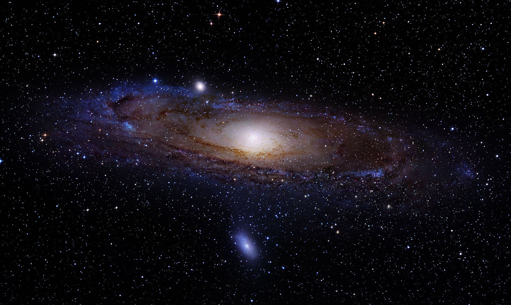

# 移动端携程网首页制作

[TOC]

访问地址：m.ctrip.com

技术：布局采用flex

# 一、初始化样式


# 二、布局


常见flex布局思路：


# 三、背景线性渐进


注意：**背景渐变必须要添加浏览器私有前缀**


# 四、搜索栏


```html
<div class="search-index">
    <div class="search">搜索：目的地/酒店/景点/航班号</div>
    <a href="#" class="user">我 的</a>
</div>
```

```css
body {
    max-width: 540px;
    min-width: 320px;
    margin: 0 auto;
    font: normal 14px/1.5 Tahoma, "Lucida Grande", Verdana, "Microsoft Yahei", STXihei, hei;
    color: #000;
    background: #f2f2f2;
    overflow-x: hidden;
    -webkit-tap-highlight-color: transparent;
}
ul {
    list-style: none;
    /* ul有默认的margin和padding值 */
    margin: 0;
    padding: 0;
}
a {
    text-decoration: none;
    color: #222;
}
div {
    box-sizing: border-box;
}
.search-index {
    display: flex;
    /* 固定定位与父元素无关，以屏幕为主，用max-width和min-width限定宽度 */
    position: fixed;
    top: 0;
    left: 50%;
    /* 固定的盒子应该有宽度 */
    -webkit-transform: translateX(-50%);
    transform: translateX(-50%);
    width: 100%;
    max-width: 540px;
    min-width: 320px;
    height: 44px;

}
.search {
    position: relative;
    height: 26px;
    line-height: 24px;
    border: 1px solid #ccc;
    flex: 1;
    margin: 7px;
    border-radius: 15px;
    font-size: 12px;
    color: #666;
    padding-left: 30px;
    box-shadow: 0 2px 4px rgba(0,0,0,0.2);
    background-color: #fff;
}
.search::before {
    content: "";
    position: absolute;
    top: 5px;
    left: 7px;
    height: 15px;
    width: 15px;
    background: url(../images/spirites.png) no-repeat ;
    background-size: 22px auto;
}
.user {
    width: 44px;
    height: 44px;
    font-size: 12px;
    text-align: center;
    color: #fff;
    margin-right: 8px;
}
.user::before {
    content: "";
    display: block;
    height: 22px;
    width: 22px;
    background: url(../images/spirites.png) no-repeat 0 -37px;
    background-size: 22px auto;
    margin: 4px auto -2px;
}
```


# 五、焦点图（轮播图）


```html
<div class="focus">
    <ul>
        <li></li>
        <li></li>
        <li></li>
        <li></li>
        <li></li>
    </ul>
    <!-- 小圆点 -->
    <ol>
        <li class="current"></li>
        <li></li>
        <li></li>
    </ol>
</div>
```

```css
.focus {
  position: relative;
  overflow: hidden;
}

.focus img {
  width: 100%;
}

.focus ul {
  overflow: hidden;
  width: 500%;
  margin-left: -100%;
}

.focus ul li {
  float: left;
  width: 20%;
}

.focus ol {
  position: absolute;
  bottom: 25px;
  right: 20px;
  margin: 0;
}

.focus ol li {
  display: inline-block;
  width: 5px;
  height: 5px;
  background-color: #fff;
  list-style: none;
  border-radius: 2px;
  transition: all 0.3s;
}

.focus ol li.current {  /*.current 前面不要有空格*/
  width: 20px;
}
```

```js
window.addEventListener('load', function () {
  //1、 获取元素
  var focus = document.querySelector('.focus');
  var ul = focus.children[0];
  var ol = focus.children[1];
  //获得focus的宽度
  var w = focus.offsetWidth;

  //2、利用定时器自动轮播播放图片
  var index = 0;
  var timer = setInterval(function () {
    index++;
    var translatex = -index * w;
    ul.style.transition = 'all 0.3s';
    ul.style.transform = 'translateX(' + translatex + 'px)';
  }, 2000);

  //等着过渡完成之后，再去判断，监听过度完成事件
  ul.addEventListener('transitionend', function () {
    //无缝滚动
    if (index >= 3) {
      index = 0;
      //去掉过渡效果 这样才能让ul快速的跳到第一张图片 因为过渡效果是需要花费时间的
      ul.style.transition = 'none';
      //利用最新索引号乘以宽度去移动图片
      var translatex = -index * w;
      ul.style.transform = 'translateX(' + translatex + 'px)';
    } else if (index < 0) {
      index = 2;
      //去掉过渡效果 这样才能让ul快速的跳到第一张图片 因为过渡效果是需要花费时间的
      ul.style.transition = 'none';
      //利用最新索引号乘以宽度去移动图片
      var translatex = -index * w;
      ul.style.transform = 'translateX(' + translatex + 'px)';

    }

    // 小圆点跟随变化
    // 把ol 里面li带有current类名的选出来去掉类名 remove  不用for循环
    ol.querySelector('.current').classList.remove('current');
    // 让当前索引号的小li加上current
    ol.children[index].classList.add('current');
  });

  //手指滑动轮播图
  var startX = 0;
  var moveX = 0;
  var flag = false;
  ul.addEventListener('touchstart', function (e) {
    startX = e.targetTouches[0].pageX;
    //手指触摸的时候停止定时器
    clearInterval(timer);
  });

  ul.addEventListener('touchmove', function (e) {
    //计算移动距离
    moveX = startX = e.targetTouches[0].pageX - startX;
    // 移动盒子：原来的距离+手指移动的距离
    var translatex = -index * w + moveX;
    //手指拖动的时候不需要拖动效果，所以要取消拖动效果
    ul.style.transition = 'none';
    ul.style.transform = 'translateX(' + translatex + 'px)';
    flag = true;  //用户手指移动
    e.defaultPrevented(); //阻止滚动屏幕的行为
  });

  // 手指离开 根据移动的距离去判断是否回弹还是播放下一张或者下一张
  ul.addEventListener('touchend', function () {
    if(flag) {
      //如果移动距离大于50像素，就播放下一张或者下一张
      if (moveX > 50) {
        //右滑 播放上一张
        if (moveX > 0) {
          index--;
        } else {
          //左滑  播放下一张
          index++;
        }
        var translatex = -index * w;
        ul.style.transition = 'all 0.3s';
        ul.style.transform = 'translateX(' + translatex + 'px)';
      } else { //像素小于50就回弹 
        var translatex = -index * w;
        ul.style.transition = 'all 0.1s';
        ul.style.transform = 'translateX(' + translatex + 'px)';
      }
    }

    //手指离开重新开始定时器
    clearInterval(timer); //保证页面只有一个定时器运行
    var timer = setInterval(function () {
      index++;
      var translatex = -index * w;
      ul.style.transition = 'all 0.3s';
      ul.style.transform = 'translateX(' + translatex + 'px)';
    }, 2000);
  });
})
```


# 六、局部导航栏

```html
<ul class="local-nav">
    <li>
        <a href="#" title="景点·玩乐">
            <span class="local-nav-icon-icon1" ></span>
            <span>景点·玩乐</span>
        </a>
    </li>
    <li>
        <a href="#" title="门票活动">
            <span class="local-nav-icon-icon2" ></span>
            <span>门票活动</span>
        </a>
    </li>
    <li>
        <a href="#">
            <span class="local-nav-icon-icon3"></span>
            <span>美食林</span>
        </a>
    </li>
    <li>
        <a href="#">
            <span class="local-nav-icon-icon4"></span>
            <span>周边游</span>
        </a>
    </li>
    <li>
        <a href="#">
            <span class="local-nav-icon-icon5 "></span>
            <span>一日游</span>
        </a>
    </li>
</ul>
```

```css
/* local-nav */
.local-nav {
    display: flex;
    height: 64px;
    margin: 3px 4px;
    border-radius: 8px;
}
.local-nav li {
    flex: 1;
}
.local-nav a {
    display: flex;
    flex-direction: column;
    /* 侧轴居中对齐 单行 */
    align-items: center;
    font-size: 12px;
}
.local-nav li [class^="local-nav-icon"]{
    width: 32px;
    height: 32px;
    margin-top: 8px;
    background: url(../images/ul-spirites.png) no-repeat -4px -6px;
    background-size: 40px auto;
}
.local-nav li .local-nav-icon-icon2 {
    background-position: -4px -46px;
}
.local-nav li .local-nav-icon-icon3 {
    background-position: -4px -85px;
}
.local-nav li .local-nav-icon-icon4 {
    background-position: -4px -126px;
}
.local-nav li .local-nav-icon-icon5 {
    background-position: -4px -166px;
}
```


# 七、主导航栏

```html
<nav>
    <div class="nav-common">
        <div class="nav-items">
            <a href="#">酒店</a>
        </div>
        <div class="nav-items">
            <a href="#">海外酒店</a>
            <a href="#">特价酒店</a>
        </div>
        <div class="nav-items">
            <a href="#">海外酒店</a>
            <a href="#">特价酒店</a>
        </div>
    </div>
    <div class="nav-common">
        <div class="nav-items">
            <a href="#">机票</a>
        </div>
        <div class="nav-items">
            <a href="#">火车票</a>
            <a href="#">特价机票</a>
        </div>
        <div class="nav-items">
            <a href="#">汽车票</a>
            <a href="#">租车·专车</a>
        </div>
    </div>
    <div class="nav-common">
        <div class="nav-items">
            <a href="#">旅游</a>
        </div>
        <div class="nav-items">
            <a href="#">门票</a>
            <a href="#">目的地攻略</a>
        </div>
        <div class="nav-items">
            <a href="#">邮轮旅行</a>
            <a href="#">定制旅行</a>
        </div>
    </div>
</nav>
```

```css
nav {
    border-radius: 8px;
    margin: 0 4px 3px;
    overflow: hidden;
}
.nav-common {
    display: flex;
    height: 78px;
    background-color: pink;
}
.nav-common:nth-child(1) {
    background: -webkit-linear-gradient(left,#fa5a55,#fa994d);
}
.nav-common:nth-child(2) {
    background: -webkit-linear-gradient(left,#4b90ed,#53bced);
    margin: 4px 0;
}
.nav-common:nth-child(3) {
    background: -webkit-linear-gradient(left,#34c2a9,#6cd559);
}
.nav-items {
    flex: 1;
    display: flex;
    flex-direction: column;
}
.nav-items:nth-child(-n+2) {
    border-right: 1px solid #fff;
}
.nav-items a {
    flex: 1;
    text-align: center;
    line-height: 39px;
    color: #fff;
    font-size: 14px;
    text-shadow: 1px 1px rgba(0,0,0,0.2);
}
.nav-items a:nth-child(1) {
    border-bottom: 1px solid #fff;
}
.nav-items:nth-child(1) a {
    border: 0;
    background: url(../images/hotel.png) no-repeat bottom center;
    background-size: 73px auto;
    line-height: 60px;
}
.nav-items-item2 {
    background: url(../images/flight.png) ;
}
.nav-items-item3 {
    background: url(../images/hotel.png);
}
```


# 八、侧导航栏

```html
<ul class="subnav-entry">
    <li>
        <a href="#">
            <span class="subnav-entry-icon-icon1"></span>
            <span>自由行</span>
        </a>
    </li>
    <li>
        <a href="#">
            <span class="subnav-entry-icon-icon2"></span>
            <span>自由行</span>
        </a>
    </li>
    <li><a href="#">
        <span class="subnav-entry-icon-icon3"></span>
        <span>电话卡</span>
        </a>
    </li>
    <li><a href="#">
        <span class="subnav-entry-icon"></span>
        <span>报线</span>
        </a>
    </li>
    <li><a href="#">
        <span class="subnav-entry-icon"></span>
        <span>自由行</span>
        </a>
    </li>
    <li><a href="#">
        <span class="subnav-entry-icon"></span>
        <span>自由行</span>
        </a>
    </li>
    <li><a href="#">
        <span class="subnav-entry-icon"></span>
        <span>自由行</span>
        </a>
    </li>
    <li><a href="#">
        <span class="subnav-entry-icon"></span>
        <span>自由行</span>
        </a>
    </li>
    <li><a href="#">
        <span class="subnav-entry-icon"></span>
        <span>自由行</span>
        </a>
    </li>
    <li><a href="#">
        <span class="subnav-entry-icon"></span>
        <span>自由行</span>
        </a>
    </li>
</ul>
```

```css
.subnav-entry {
    display: flex;
    flex-wrap: wrap;
    border-radius: 8px;
    background-color: #fff;
    margin: 0 4px;
    padding: 5px 0;
}

.subnav-entry li {
    /* 里面的子盒子可以写百分比 相对于父盒子来说 */
    flex: 20%;
}
.subnav-entry a{
    display: flex;
    flex-direction: column;
    align-items: center;
    font-size: 14px;
}
[class^="subnav-entry-icon"] {
    width: 28px;
    height: 28px;
    margin-top: 4px;
    background: url(../images/subnav.png) no-repeat;
    background-size: 28px auto;
}
.subnav-entry-icon-icon2 {
    background-position: 0px -28px;

```


# 九、返回顶部

核心思想：

1. 滚动到某个地方显示
2. 事件：scroll页面滚动事件
3. 若被卷去的头部（window.pageYOffset）大于某个数值，点击，window.scroll(0,0)返回顶部

```html
<!-- 返回顶部模块 -->
<div class="goBack"></div>
```

```css
.goBack {
  display: none;
  position: fixed;
  bottom: 50px;
  right: 20px;
  width: 38px;
  height: 38px;
  background: url(../images/goBack.png) no-repeat;
  background-size: 38px 38px;
}

```

```js
//返回顶部
var goBack = document.querySelector('.goBack');
var nav = document.querySelector('nav');
window.addEventListener('scroll', function () {
    if (window.pageYOffset >= nav.offsetTop) {
        goBack.style.display = 'block';
    } else {
        goBack.style.display = 'none';
    }
});

//点击事件
goBack.addEventListener('click',function() {
    window.scroll(0,0);
});
```

